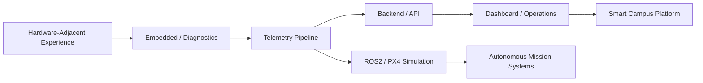

<div align="center">


[](https://git.io/typing-svg)

<br/>


</div>

---

## 👨‍💻 About Me

I am **Lee Youngjun**, a Computer Science student at **Paejae University** in Korea 🇰🇷.

My interest in programming did not begin only from web or app development.
It grew from hardware-adjacent work such as **PCB production flow, BOM handling, datasheet reading, OrCAD-based schematic review, component organization, and debugging around real production processes**.

Through that experience, I became interested in the software layers that make real systems work:

* device communication
* telemetry pipelines
* backend logic
* diagnostics
* dashboards
* field operation tools
* autonomous system simulation
* smart campus service infrastructure

I try to build projects with runnable structure, implementation evidence, realistic constraints, and documentation that explains **why the system exists**.

---

## 🧭 Current Direction

<div align="center">

```text
Embedded / Telemetry / Diagnostics
        +
ROS2 / PX4 / Autonomous Systems
        +
Smart Campus Operation Platforms
        +
Backend & Field-Facing Dashboards
```

</div>

> **Not just UI. Not just ideas. Build the flow. Show the evidence. Document the constraints.**

---

## 🚀 Main Portfolio

<div align="center">

### 🛰️ Ground Control / Embedded / Diagnostics

<a href="https://github.com/gxmzung/sat-gcs-defense-space-plus10">
  
</a>
<a href="https://github.com/gxmzung/fieldops-embedded-diagnostic-suite">
  
</a>

<br/><br/>

### 🛩️ Drone / Autonomous Systems

<a href="https://github.com/gxmzung/twinflight-mission-v2">
  
</a>
<a href="https://github.com/gxmzung/wildtrack-assist">
  
</a>

<br/><br/>

### 🏫 Smart Campus / Campus Operations

<a href="https://github.com/gxmzung/CityBrain">
  
</a>
<a href="https://github.com/gxmzung/paejae-campus-os-v1">
  
</a>

</div>

---

## 🗺️ Portfolio Map



---

## 🧩 Project Categories

| Category           | Repository                                                                                            | Focus                                                                                                                                                 |
| ------------------ | ----------------------------------------------------------------------------------------------------- | ----------------------------------------------------------------------------------------------------------------------------------------------------- |
| 🛰️ Ground Control | [`sat-gcs-defense-space-plus10`](https://github.com/gxmzung/sat-gcs-defense-space-plus10)             | Satellite ground-control style telemetry pipeline with C++ packet handling, Java mission server, Python tools, and React dashboard                    |
| 🛠️ Diagnostics    | [`fieldops-embedded-diagnostic-suite`](https://github.com/gxmzung/fieldops-embedded-diagnostic-suite) | Embedded field diagnostics toolkit with serial parsing, GNSS tracking, telemetry monitoring, C scheduler logic, log analysis, and dashboard prototype |
| 🛩️ Drone / PX4    | [`twinflight-mission-v2`](https://github.com/gxmzung/twinflight-mission-v2)                           | ROS2 / PX4 mission simulation with YAML mission config, offboard control flow, and PX4 SITL workflow                                                  |
| 🚁 Field Support   | [`wildtrack-assist`](https://github.com/gxmzung/wildtrack-assist)                                     | Search operation support system with backend, dashboard, drone simulator, report ranking, and AI-assisted validation                                  |
| 🏫 Smart Campus    | [`CityBrain`](https://github.com/gxmzung/CityBrain)                                                   | Smart campus cafeteria MVP with FastAPI backend, Android app, admin dashboard, student UI, operation logs, and assistant prototype                    |
| 🏢 Campus OS       | [`paejae-campus-os-v1`](https://github.com/gxmzung/paejae-campus-os-v1)                               | Smart campus platform scaffold for building metadata, room monitoring, admin dashboard, student services, IoT integration, and digital twin expansion |

---

## 🧪 Supporting Repositories

| Repository                                                                          | Role                                                                                                                       |
| ----------------------------------------------------------------------------------- | -------------------------------------------------------------------------------------------------------------------------- |
| [`skyedge_vtol`](https://github.com/gxmzung/skyedge_vtol)                           | VTOL mission stack prototype with ROS2-style mission manager, PX4 bridge, safety manager, guidance logic, and vision nodes |
| [`ros2-px4-yaml-param-debug`](https://github.com/gxmzung/ros2-px4-yaml-param-debug) | ROS2/PX4 debugging notes focused on YAML parameter validation and mission configuration checks                             |
| [`Dorm_Mail_Pcu_Style`](https://github.com/gxmzung/Dorm_Mail_Pcu_Style)             | Dormitory mail and lost-item management prototype for campus operations                                                    |
| [`LingoLink`](https://github.com/gxmzung/LingoLink)                                 | Korean-Spanish voice translation prototype with mobile, backend, and optional firmware-oriented architecture               |
| [`Paejae_Apptech`](https://github.com/gxmzung/Paejae_Apptech)                       | Early Paejae campus app experiment with Flutter and backend prototypes                                                     |
| [`Cs_Resources`](https://github.com/gxmzung/Cs_Resources)                           | CS study archive covering C, C++, Java, Python, Linux, networking, embedded basics, and interview preparation              |
| [`University_Archive`](https://github.com/gxmzung/University_Archive)               | University learning archive for coursework, project notes, academic records, and long-term study process tracking          |

---

## 🛠️ Tech Stack

### 🧑‍💻 Core Languages

<p>
  
  
  
  
  
</p>

### ⚙️ Backend / API

<p>
  
  
  
  
</p>

### 🤖 Robotics / Systems

<p>
  
  
  
  
</p>

### 📱 App / Dashboard

<p>
  
  
  
  
</p>

### 🧰 Tools

<p>
  
  
  
  
</p>

---

## 🎙️ Building / Mentoring / Project Leadership

* 🧭 Helping peers understand CS courses, projects, and career direction
* 🛠️ Leading small student projects from idea to prototype
* 🏫 Building campus-oriented service prototypes based on real student problems
* 🤝 Communicating with professors, university staff, and industry contacts
* 📢 Preparing presentations, project documents, and competition materials
* 🔍 Turning vague ideas into runnable structures, roadmaps, and demos

---

## 📌 Engineering Style

I try to build projects with:

* clear system boundaries
* realistic constraints
* runnable or inspectable structure
* backend + dashboard + operation flow
* documentation that explains why the system exists
* implementation evidence beyond screenshots
* honest limitations and future work
* hardware-adjacent or operations-oriented thinking

---

## 📊 GitHub Stats

<div align="center">


<br/><br/>


</div>

---

## 📫 Contact

<p>
  <a href="mailto:leeyj4748@naver.com">
    
  </a>
  <a href="https://github.com/gxmzung">
    
  </a>
</p>

---

<div align="center">

### Build systems that survive outside the classroom.


</div>
