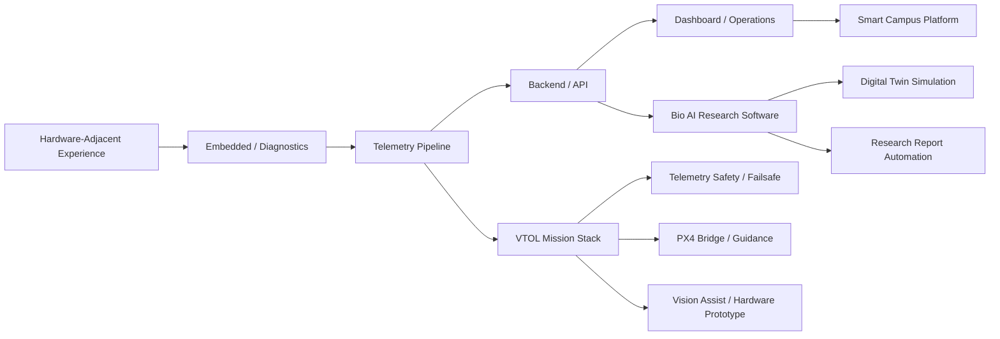

<div align="center">


[](https://git.io/typing-svg)

<br/>


</div>

---

## 👨‍💻 About Me

I am **Lee Youngjun**, a Computer Science student at **Paejae University** in Korea 🇰🇷.

My interest in programming did not begin only from web or app development.
It grew from hardware-adjacent work such as **PCB production flow, BOM handling, datasheet reading, OrCAD-based schematic review, component organization, and debugging around real production processes**.

Through that experience, I became interested in the software layers that make real systems work:

* device communication
* telemetry pipelines
* backend logic
* diagnostics
* dashboards
* field operation tools
* autonomous system simulation
* VTOL / mission software architecture
* smart campus service infrastructure
* bio experiment data systems
* research software and report automation

I try to build projects with runnable structure, implementation evidence, realistic constraints, and documentation that explains **why the system exists**.

---

## 🧭 Current Direction

<div align="center">

```text
Embedded / Telemetry / Diagnostics
        +
VTOL / Mission Systems / ROS2-PX4 Style Flow
        +
Bio AI / Research Software / Digital Twin
        +
Smart Campus Operation Platforms
        +
Backend & Field-Facing Dashboards
```

</div>

> **Not just UI. Not just ideas. Build the flow. Show the evidence. Document the constraints.**

---

## 🚀 Main Portfolio

<div align="center">

### 🛰️ Embedded / Telemetry / Diagnostics

<a href="https://github.com/gxmzung/telemetry-packet-parser-c">
  
</a>
<a href="https://github.com/gxmzung/fieldops-embedded-diagnostic-suite">
  
</a>

<br/><br/>

### 🛩️ VTOL / Mission Systems

<a href="https://github.com/gxmzung/skyedge_vtol">
  
</a>
<a href="https://github.com/gxmzung/mission-state-machine-cpp">
  
</a>

<br/><br/>

### 🧬 Bio AI / Product Systems

<a href="https://github.com/gxmzung/BioDockLab">
  
</a>
<a href="https://github.com/gxmzung/paejae-pick-2-app">
  
</a>

</div>

---

## 🗺️ Portfolio Map



---

## 🧩 Project Categories

| Category                      | Repository                                                                                            | Focus                                                                                                                                                                                                  |
| ----------------------------- | ----------------------------------------------------------------------------------------------------- | ------------------------------------------------------------------------------------------------------------------------------------------------------------------------------------------------------ |
| 🛰️ Telemetry / C Systems     | [`telemetry-packet-parser-c`](https://github.com/gxmzung/telemetry-packet-parser-c)                   | C-based telemetry packet parser and UDP mission diagnostics toolkit                                                                                                                                    |
| 🛠️ Embedded Diagnostics      | [`fieldops-embedded-diagnostic-suite`](https://github.com/gxmzung/fieldops-embedded-diagnostic-suite) | Embedded field diagnostics toolkit with serial parsing, GNSS tracking, telemetry monitoring, C scheduler logic, log analysis, and dashboard prototype                                                  |
| 🛩️ VTOL Mission Stack        | [`skyedge_vtol`](https://github.com/gxmzung/skyedge_vtol)                                             | Unified VTOL mission stack with mission manager, telemetry safety checks, PX4 bridge scaffold, waypoint guidance, vision-assisted logic, ESP32 hardware prototypes, smoke tests, and GitHub Actions CI |
| ⚙️ Mission Logic / C++        | [`mission-state-machine-cpp`](https://github.com/gxmzung/mission-state-machine-cpp)                   | C++ mission state machine for autonomous systems, telemetry health checks, failsafe transitions, and mission-control flow                                                                              |
| 🧬 Bio AI / Research Software | [`BioDockLab`](https://github.com/gxmzung/BioDockLab)                                                 | Bio AI research platform connecting experiment data, Node API, TypeScript dashboard, Python analysis, digital twin simulation, and report automation                                                   |
| 🏫 Campus Product             | [`paejae-pick-2-app`](https://github.com/gxmzung/paejae-pick-2-app)                                   | Campus life platform for Paejae University students with Flutter app structure, student services, and operation-oriented product flow                                                                  |

---

## 🧪 Supporting Repositories

| Repository                                                                                | Role                                                                                                                                      |
| ----------------------------------------------------------------------------------------- | ----------------------------------------------------------------------------------------------------------------------------------------- |
| [`embedded-telemetry-lab-c`](https://github.com/gxmzung/embedded-telemetry-lab-c)         | C-based telemetry packet parsing and embedded diagnostics lab focused on anomaly detection, CRC validation, and mission-session reporting |
| [`uart-diagnostic-cli-c`](https://github.com/gxmzung/uart-diagnostic-cli-c)               | C-based UART log parser and embedded diagnostic CLI for field operation systems                                                           |
| [`binary-packet-inspector-c`](https://github.com/gxmzung/binary-packet-inspector-c)       | C-based binary packet inspector for embedded telemetry and mission diagnostics                                                            |
| [`sat-gcs-defense-space-plus10`](https://github.com/gxmzung/sat-gcs-defense-space-plus10) | Satellite ground-control style telemetry pipeline with packet handling, mission server concepts, Python tools, and dashboard flow         |
| [`twinflight-mission-v2`](https://github.com/gxmzung/twinflight-mission-v2)               | ROS2 / PX4 mission simulation with YAML mission config, offboard control flow, and PX4 SITL workflow                                      |
| [`ros2-px4-yaml-param-debug`](https://github.com/gxmzung/ros2-px4-yaml-param-debug)       | ROS2/PX4 debugging notes focused on YAML parameter validation and mission configuration checks                                            |
| [`Memory-Twin`](https://github.com/gxmzung/Memory-Twin)                                   | AI memory agent platform focused on personal memory preservation, ethical data design, product planning, and long-term AI interaction     |
| [`Cs_Resources`](https://github.com/gxmzung/Cs_Resources)                                 | CS study archive covering C, C++, Java, Python, Linux, networking, embedded basics, and interview preparation                             |

---

## 🛠️ Tech Stack

### 🧑‍💻 Core Languages

<p>
  
  
  
  
  
  
  
  
</p>

### ⚙️ Backend / API

<p>
  
  
  
  
  
  
</p>

### 🤖 Robotics / Systems

<p>
  
  
  
  
  
  
</p>

### 📱 App / Dashboard

<p>
  
  
  
  
  
  
  
  
</p>

### 🧬 Bio AI / Research Software

<p>
  
  
  
  
</p>

### 🧠 AI / Data / Simulation

<p>
  
  
  
  
  
  
</p>

### 🗄️ Data / DevOps

<p>
  
  
  
  
  
  
  
</p>

### 🧰 Tools

<p>
  
  
  
  
</p>

---

## 🎙️ Building / Mentoring / Project Leadership

* 🧭 Helping peers understand CS courses, projects, and career direction
* 🛠️ Leading small student projects from idea to prototype
* 🏫 Building campus-oriented service prototypes based on real student problems
* 🤝 Communicating with professors, university staff, and industry contacts
* 📢 Preparing presentations, project documents, and competition materials
* 🔍 Turning vague ideas into runnable structures, roadmaps, and demos
* 🧪 Connecting research ideas with software architecture and implementation evidence

---

## 📌 Engineering Style

I try to build projects with:

* clear system boundaries
* realistic constraints
* runnable or inspectable structure
* backend + dashboard + operation flow
* documentation that explains why the system exists
* implementation evidence beyond screenshots
* honest limitations and future work
* hardware-adjacent or operations-oriented thinking
* research software structure for data, analysis, simulation, and reports

---

## 📊 GitHub Stats

<div align="center">


<br/><br/>


</div>

---

## 📫 Contact

<p>
  <a href="mailto:leeyj4748@naver.com">
    
  </a>
  <a href="https://github.com/gxmzung">
    
  </a>
</p>

---

<div align="center">

### Build systems that survive outside the classroom.


</div>
